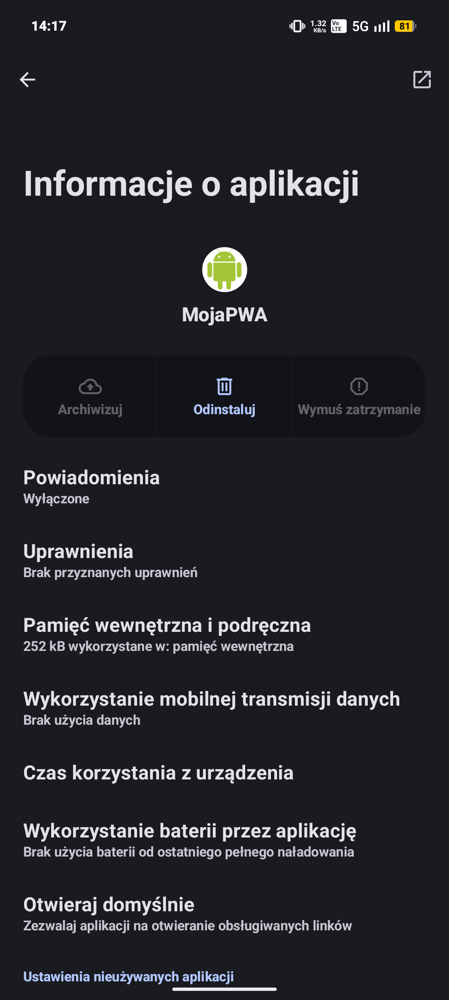
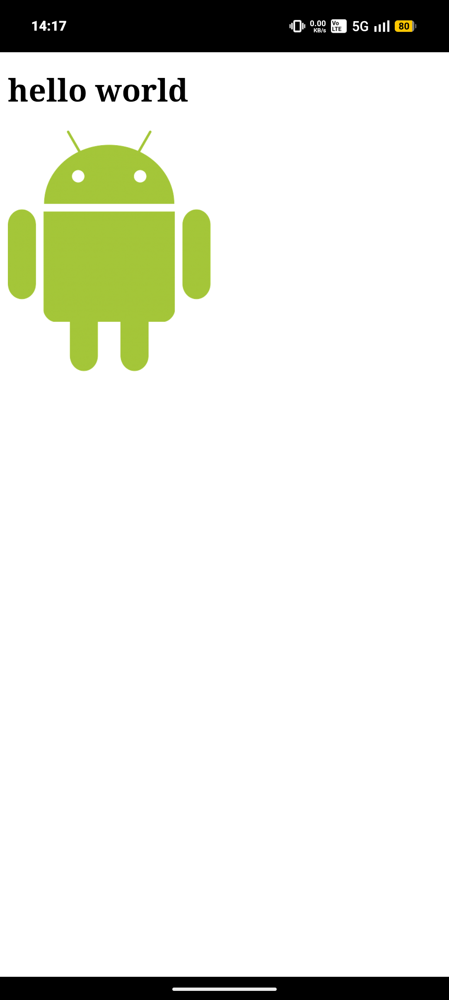

# Lab 01 – [Tworzenie aplikacji PWA]
## Co zostało zrealizowane
Została wykonana prosta strona z tesktem, obrazem oraz przyciskiem wyświetlającym się w obsługiwanych przeglądarkach, a także z widokiem offline.
## Uruchomienie
W folderze projektowym nadrzędnym lab01 należy zalogować się do firebase a następne zrobić firebase deploy.
W przeglądarce wpisać adres na którym hostujemy stronę (aktualnie jest to https://lab01-d5174.web.app/ )
## Trudności / refleksja (opcjonalnie)
Każdorazowa zmiana rewizji w workerze. A także jak wrzucić własną stronę offline (podmienić nazwę z offline na 404..)
## Obrazki

